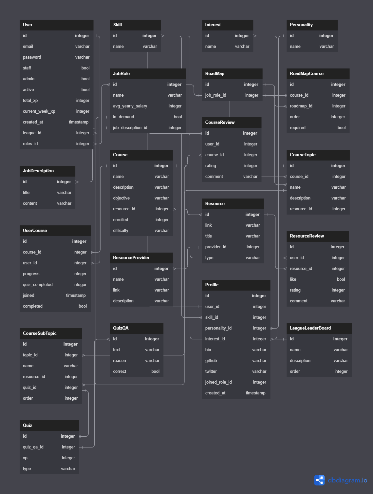

# Roadflow Api

This is the backend api for RoadFlow. It uses DRF for api development and MindsDB NLP Models for user reviews classification and sentiment. The API follows REST API requirements. It can be tested from the Swagger documentation or any client.

## Why Roadflow?

The main reason for embarking on building this project is the understanding that most resources online are great at teaching and also misleading young developers. They focus on teaching core or necessary aspect of development but loose a lot of value due to not being organized for the learner.

Many students have met me trying to understand how they can start programming. I don’t have the time to really direct them. So, I usually direct them to online videos which further confuses them. Not because the videos are not great, but because the learner doesn’t know what comes first, next, or if they following the right path.

### Architecture

Roadflow provides value to users by giving them structured roadmap with organized open source learning resources. Helping them to utilize those online free videos, articles and lectures effectively.

It has two main parts, API and Client. The API is built in Django and the Client which is the frontend is built in NextJs. JWT is used as the main authentication mechanism. Swagger is used for the API documentation.

Users can find courses, enroll in them, engage in projects and quizzes. They can track their progress on every enrolled courses in their dashboard.

### Challenges

1. Knowing the user flow, how the user experience should feel. I used other platforms like Coursera and EDX has case study.
2. Picking a method that ensures learners understand what they learned. After learning from case studies, I built a quiz system that tests their knowledge on each modules.

## Figma Design

Here is a link to the [figma](https://www.figma.com/file/4sWAOaXGdd16N5AlyFVSBl/RoadTrack-Project?node-id=10-39&t=J5xBuuZrD2TIcSLZ-0).

## Github Project

Here is a link to the [Github Project](https://github.com/users/devvspaces/projects/2/views/2?layout=board).

## DB Diagram Design

Here is a db diagram for the project database - [Diagram](https://dbdiagram.io/d/6437cb1c8615191cfa8d9bc1)



## Prerequisites

- Python 3
- MindsDB Python SDK
- Redis

## Installing

A step by step series of examples that tell you how to get a development environment running.

> First you have to clone the project on your machine

- Setup virtual environment

    Debian

    ```bash
    python -m venv venv
    source venv/bin/activate
    ```

    Windows

    ```bash
    python -m venv venv
    venv\Scripts\activate
    ```

- Install dependencies in the project root dir

    ```bash
    pip install -r requirements.txt
    cd src
    mkdir logs
    ```

- Setup the env file

    ```bash
    cp env.example .env
    ```

    For the email config:

    This is not required, for it is used to send OTP for account registration. Email sending is disabled by default in development.

    Redis config:

    If you don't have redis installed you can configure `settings/base.py` to use Django Memcache. Cache is used for OTP verification.

- Run migrations

    ```bash
    python manage.py migrate
    ```

> The site is configured to run with SQLite but you can configure it to use postgress in production.

## Running Tests

Pytest is heavily used for testing. To run tests, make sure you are in the `src` directory before you run the command below.

```bash
pytest
```

## Running the API

To run the API on your machine. Make sure you are in the `src` directory before you run the command below.

```bash
python manage.py runserver
```

API server will run on `http://localhost:8000/`. Visit [Swagger](http://localhost:8000/docs/) to read the Swagger API documentation.

## Deployment

Check out the deployment guide at [Deployment](./docs/DEPLOYMENT.md)

## ⛏️ Built Using

- [Django](https://www.djangoproject.com/) - Web Framework
- [Django Rest Framework](https://www.django-rest-framework.org/) - Building Web APIs
- [Redis](https://redis.io/) - In-memory data store
- [Python](https://www.python.org/) - Programming Language
